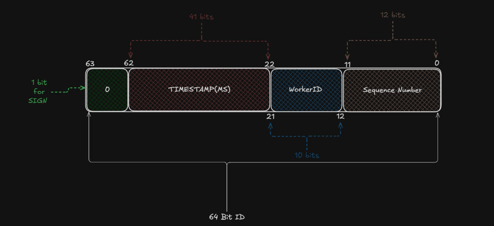

# Snowflake

Snowflake is a distributed 64-bit unique ID generator written from scratch in Go. It is an educational prototype built to understand the low-level bit manipulation, monotonic clock drift resilience, and distributed worker coordination mechanics behind Twitter's original Snowflake system: [[Announcing Snowflake]](https://blog.x.com/engineering/en_us/a/2010/announcing-snowflake).




## How It Works

A traditional database uses auto-incrementing integers (`1, 2, 3...`) for primary keys. That works until you shard across multiple databases, where a single central auto-increment counter becomes an impossible bottleneck. The naive fix is to switch to random UUIDv4 (128-bit). But UUIDv4 has a massive hidden cost: because it is completely random, it shatters database B-Tree index locality, forcing expensive disk page splits on every single insert.

Snowflake solves this by generating 64-bit, time-ordered (k-sorted) integers in CPU memory that append neatly to the end of B-Trees without index fragmentation, and with zero network coordination between nodes during generation:

- **64-bit Binary Packing:** We pack four separate fields into an 8-byte signed integer (`int64`):
  - **Bit 63 (Sign Bit):** Always `0` so the number is strictly positive across databases (PostgreSQL/MySQL `BIGINT`), Protobuf, and JSON without signed/unsigned conversion bugs.
  - **Bits 62 to 22 (41 bits Timestamp):** Milliseconds elapsed since our custom project epoch (October 4, 2026). With 41 bits, the maximum number of milliseconds is:
    ```text
            (2^41 - 1) ms                 2,199,023,255,551 ms
    -----------------------------  =  ----------------------------  ≈ 69.7 years
     1000 * 60 * 60 * 24 * 365.25        31,557,600,000 ms/year
    ```
    Starting from October 4, 2026, this gives the cluster collision-free runway until the year **2096** before the timestamp rolls over.
  - **Bits 21 to 12 (10 bits Worker ID):** Supports up to **1,024 independent machines/containers** generating IDs simultaneously.
  - **Bits 11 to 0 (12 bits Sequence):** Rolls from `0` to `4,095` to allow up to **4,096 IDs per millisecond per worker** (>4 million IDs/sec per node).
- **Bitwise Math & Masking:** Instead of slow arithmetic, bitmasks and offsets are derived using two's complement bitwise XOR shifts (`maxWorkerID = -1 ^ (-1 << 10)` gives `1023`), and packed with left-shifts and bitwise OR: `((now - epoch) << 22) | (workerID << 12) | sequence`.
- **Clock Drift & NTP Resilience:** Real-world server clocks are not monotonic — Network Time Protocol (NTP) daemons can step clocks backwards. If drift is 5ms or less, the generator safely sleeps out the difference (slew mode). If drift is larger, it immediately rejects generation with an error to prevent duplicate ID collisions.
- **Sequence Rollover & Spin-Wait:** When a node exhausts its 4,096 IDs within the same millisecond, the sequence rolls over to `0`. The generator enters a tight spin-wait loop until the system clock ticks forward to the next millisecond before issuing the next ID.
- **Dynamic Worker ID Leasing (etcd):** On startup, each node runs an atomic Compare-And-Swap transaction (`CreateRevision == 0`) to claim the first free key under `/snowflake/workers/<id>` with a 10-second TTL lease and a background heartbeat. If a node crashes, etcd's lease expires and reclaims the worker ID automatically. Zero human coordination, zero collisions.


## Requirements

- Go 1.22+
- Docker & Docker Compose
- `protoc` (optional, for regenerating protobuf stubs)


## Setup

### 1. Start the etcd Coordinator

Launch etcd in one command:

```bash
make up
# or: docker compose up -d
```

This starts:
- **etcd** (`:2379`) — Distributed worker ID leasing and health checks via atomic Compare-And-Swap leases.

### 2. Start the Snowflake gRPC Server

Run the server on port `:50051`:

```bash
make server
# or: go run cmd/server/main.go --port=50051
```

On boot, the server registers with etcd, claims an available worker badge (e.g. Worker `0`), starts the keepalive heartbeat, and begins serving.

*(If you spin up another server in a second terminal on `--port=50052`, it will detect Worker 0 is occupied and automatically claim Worker `1`!)*


## Usage

### 1. Verification Client

Query the server over gRPC to test server status, ID generation, and ID parsing:

```bash
make client
# or: go run cmd/client/main.go
```

Output:
```text
2026/10/07 02:54:33 Server Status -> WorkerID: 0, ServerTime: 1791330873981
2026/10/07 02:54:33 Generated ID: 889502755192832 (String: 889502755192832)
2026/10/07 02:54:33 Parsed ID -> Time: 2026-10-06T23:54:33Z, WorkerID: 0, Sequence: 0
```

### 2. High-Concurrency Stress Testing

Hammer the server with concurrent worker goroutines and assert zero collisions across all generated IDs:

```bash
make stress
# or: go run cmd/stress/main.go --workers=100 --requests=1000
```

Output:
```text
Starting stress test against localhost:50051: 100 concurrent goroutines, 1000 requests each (100000 total IDs)...
Stress test completed in 1.48s
Total IDs generated: 100000 / 100000
Throughput: 67567 IDs/sec over gRPC network
```

### 3. Inspecting Cluster State in etcd

To see which physical machines currently hold which worker badges:

```bash
docker exec etcd-snowflake etcdctl get /snowflake/workers/ --prefix
```

Output:
```text
/snowflake/workers/0
YonathanT:50051
/snowflake/workers/1
YonathanT:50052
```


## Tests & Benchmarks

Run the unit and race detector test suite:

```bash
go test -v ./pkg/snowflake
```

Run in-memory generation benchmarks:

```bash
go test -bench=BenchmarkNextID -benchmem .\pkg\snowflake
```

Output:
```text
.
.
BenchmarkNextID-16    4583570    265.1 ns/op    0 B/op    0 allocs/op
```

- **Throughput:** ~4.58 Million IDs generated per second
- **Latency:** ~265 nanoseconds per operation
- **Memory Footprint:** 0 heap allocations per operation
